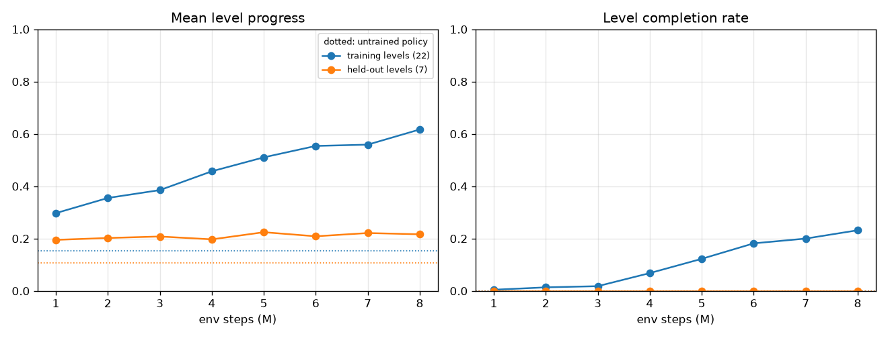
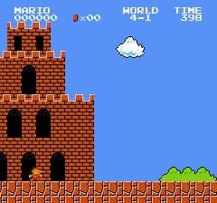
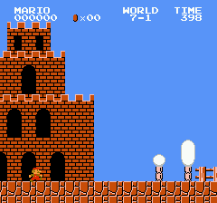
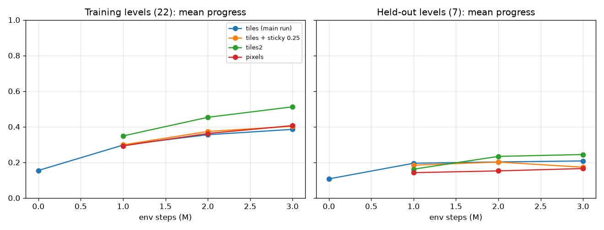

# mario-rl: Super Mario Bros. agents that generalize across levels

This started as a Stanford CS221 project (Dec 2017): Deep Q-Learning that learned to play
level 1-1. The 2026 rewrite ports it to a modern stack and changes the goal:
**train on many levels and play levels the agent has never seen.**

- **Environment**: a [Gymnasium](https://gymnasium.farama.org/) env over all 32 levels, running on
  the FCEUmm core from [stable-retro](https://github.com/Farama-Foundation/stable-retro). No
  dependency on the unmaintained `gym` / `nes-py` packages; NumPy 2 compatible.
- **Observation**: the 13x16 symbolic *tile grid* idea from 2017, now decoded straight from RAM.
  It is the same in overworld, underground, water and castle levels, which helps generalization.
  `tiles2` is a richer 8px version built from the game's collision boxes, with stompable vs
  hazard enemies, firebars, hammers and exact lift sizes, plus Mario's velocity and state.
  An 84x84 grayscale pixel mode is available for comparison.
- **Agent**: PyTorch PPO with GAE, correct bootstrapping on time-limit truncation, and optional
  [Prioritized Level Replay](https://arxiv.org/abs/2010.03934).
- **Evaluation**: a fixed train / held-out split of the levels, with periodic evaluation on both.
- **Tooling**: `pyproject.toml`, a `mario-rl` CLI, TensorBoard and JSONL logs, a pytest suite and
  GitHub Actions CI.

The original code and results are kept in [`legacy/`](legacy/README.md).

## Quick start

```bash
uv venv -p 3.11 && source .venv/bin/activate
uv pip install -e ".[dev,tensorboard,plot]"   # pulls CPU-only torch wheels (see pyproject)

# train on the 22 training levels, evaluating on the 7 held-out levels every 500k steps
mario-rl train --total-steps 10000000 --num-envs 8 --num-steps 256 --eval-interval 500000

mario-rl eval runs/<run>/latest.pt --levels test train --episodes 5   # report per level
mario-rl play runs/<run>/latest.pt --level 2-1 --output play.gif      # watch an episode
mario-rl plot runs/<run>                                              # curves.png
tensorboard --logdir runs
```

Without uv: `pip install torch --index-url https://download.pytorch.org/whl/cpu && pip install -e ".[dev]"`.
`mario-rl train --help` lists every option; they map 1:1 onto `EnvConfig` and `PPOConfig`.

Using the environment directly:

```python
import gymnasium as gym
import mario_rl  # registers the env

env = gym.make("MarioRL/SuperMarioBros-v0", levels=("1-1", "2-1"), obs="tiles")
obs, info = env.reset(seed=0)                   # obs: (4, 13, 16) uint8 tile classes
obs, reward, terminated, truncated, info = env.step(env.action_space.sample())
env.reset(options={"level": "8-1"})             # force any level
```

stable-retro runs **one emulator per process**. Close an env before creating another one in the
same process; use separate processes to run several at once (the trainer does this for you).

## How it works

### Environment (`src/mario_rl/env.py`, `smb.py`, `tiles.py`)

| | |
|---|---|
| Level select | boot the ROM, write world/stage/area into RAM on the title screen, keep an in-memory save state per level (all 32 boot in ~1.5 s) |
| Step | frame skip 4, frame stack 4; pipe / vine / area-change cut-scenes are fast-forwarded |
| Start | 0-30 random no-op frames, so enemy timing varies between episodes |
| Actions | `simple` (default, 7 actions: NOOP, right, right+A, right+B, right+A+B, A, left), `right_only`, `complex` |
| Reward | `0.1 x (Δx − clock ticks − 25·death + 50·flag)`; Δx ignores teleports through pipes |
| Episode end | terminated on death or on reaching the flag / castle axe; truncated after 3000 steps or 250 steps without new progress |
| Info | `level`, `x_pos`, `max_x`, `progress` (fraction of the level, 1.0 when the flag is reached), `flag_get`, and an `episode` summary at the end |

**`tiles2` observation** (`--obs tiles2`): `{"grid": (4, 26, 32), "vec": (10,)}`. Each 8px cell is
one of `empty, solid, stompable, hazard, platform, mario`. Mario, enemies, lifts and hammers are
rasterized from the collision boxes the game computes each frame (`$04AC`/`$04B0`/`$04D0`), and
firebar segments from the sprite table. `vec` holds Mario's x/y speed, ground / jump / fall / climb
state, size, fire power, swimming and star power.

**Tile observation**: the game keeps its foreground in a 2-page *block buffer* at `$0500`. Each of
the 13x16 screen cells becomes one of `empty, solid, enemy, platform, mario`. Enemies, lifts and
Mario come from the object tables, and coins, hidden blocks and the flagpole count as empty.
Background scenery never enters the buffer, so a castle looks the same as an overworld level.

### Levels (`src/mario_rl/levels.py`)

| split | levels |
|---|---|
| train (22) | 1-1 1-2 1-3 1-4 2-2 2-3 2-4 3-1 3-2 3-4 4-1 4-3 5-2 5-3 5-4 6-1 6-3 7-2 7-3 8-1 8-2 8-3 |
| held-out test (7) | 2-1 3-3 4-2 5-1 6-2 6-4 7-1 (overworld, athletic, underground, castle) |
| excluded (3) | 4-4 7-4 8-4: maze castles that loop until the right path is taken |

Pass `--levels` / `--eval-levels` with a preset (`train`, `test`, `all`, `no-maze`, `world1`) or a list such as `1-1,1-2`.
Note that SMB reuses some layouts (for example 6-4 is close to 1-4, and 7-3 to 2-3), so a few
held-out levels have relatives in the training set.

### Agent and training system (`ppo.py`, `models.py`, `workers.py`, `plr.py`)

- Small CNN (about 0.5M parameters) over the one-hot tile grid, with policy and value heads.
  Training uses clipped PPO with GAE(γ=0.99, λ=0.95), advantage normalization, linear LR
  annealing, gradient clipping and orthogonal init.
- Truncated episodes (time limit or stuck) bootstrap from the value of the final observation.
  Only deaths and flags are treated as terminal.
- `--level-sampler plr` turns on Prioritized Level Replay. It ranks levels by mean |GAE| of their
  latest episode (β=0.1) and mixes in a staleness term (ρ=0.1).
- **Throughput design**: the emulator runs at about 3000 frames/s per core, about 6.7x faster
  than nes-py's LaiNES. On small CPU machines, Gymnasium's lock-step `AsyncVectorEnv` loses more
  than half of that to per-step synchronization. So each worker process owns one emulator plus a
  reference to the learner's *shared-memory* policy, collects a whole rollout locally, and sends
  it back in one message. On a 4-vCPU VM without a GPU this gives about 650 env steps/s
  (2600 emulated frames/s) end-to-end with the decoupled actor/critic, PPO updates included.

## Results

All numbers come from `results/tiles-uniform-8m/` and can be reproduced with the commands in
[`results/README.md`](results/README.md). Every experiment, including the diagnostics behind the
design decisions, is logged in [`results/EXPERIMENTS.md`](results/EXPERIMENTS.md). The run trained for 8M env steps (32M frames) on the
22 training levels with uniform level sampling and the default configuration. It took about 3.4 h on a
4-vCPU VM with no GPU. Every 1M-step checkpoint was then re-evaluated with 10 stochastic episodes per
level. "Progress" is the fraction of the level reached (1.0 = flag), and "completion" is the fraction
of episodes that reach the flag or the axe.



| steps | train progress | train completion | held-out progress | held-out completion |
|---|---|---|---|---|
| untrained | 15.5% | 0.0% | 10.7% | 0.0% |
| 1M | 29.7% | 0.5% | 19.5% | 0.0% |
| 2M | 35.5% | 1.4% | 20.2% | 0.0% |
| 4M | 45.7% | 6.8% | 19.7% | 0.0% |
| 6M | 55.4% | 18.2% | 20.9% | 0.0% |
| 8M | **61.7%** | **23.2%** | **21.6%** | 0.0% |

What the results show:

1. **The training levels are learned steadily.** At 8M steps the agent completes 4-1 in 10 of 10
   episodes, 3-2 in 9, 1-1 and 6-1 in 8, and 2-3 in 6, all while training on all 22 levels at once.
   For comparison, the 2017 DQN trained only on 1-1 and finished it in about 6% of its training games.
2. **Generalization to unseen levels is weak.** On held-out levels the agent reaches twice the progress
   of an untrained policy (21.6% vs 10.7%), but almost all of that gain appears in the first 1M steps
   and then flattens. No held-out level was completed. The best held-out levels are 7-1 (41%),
   2-1 (25%) and 6-4 (24%).
3. **Interpretation.** Generic skills such as running right, jumping over gaps and jumping on the first
   enemies transfer early. After that, the policy mostly memorizes level-specific action sequences.
   With only 22 distinct training levels this is the expected regime: on Procgen, PPO needs hundreds
   of training levels before test performance approaches training performance.

| | |
|---|---|
|  |  |
| 4-1 (training level), completed | 7-1 (held-out), typical 40% run |

**A bug found along the way.** The first version shared the CNN trunk between actor and critic. In a
1M-step run it stayed at about 17% progress on both splits, and the policy collapsed to a
state-independent "right+A / right+B" distribution. Measured on a real batch, the value-loss gradient
norm was about 145 versus about 1.1 for the policy loss, so the shared features served the value
function. Decoupling the two networks and normalizing rewards (now the defaults) raised
training-level progress at 1M steps from 17.7% to 28.9%, both measured by the in-training evaluation.

### Comparisons at 3M steps

Same settings and seed as the main run, changing one thing at a time. Each row uses the checkpoint
at 3M steps, evaluated with 10 episodes per level. At this sample size, differences of about ±2-3
points are noise.

| variant | train progress | train completion | held-out progress | held-out completion |
|---|---|---|---|---|
| `tiles` (main run, 3M checkpoint) | 38.5% | 1.8% | 20.8% | 0.0% |
| `tiles` + `--sticky-prob 0.25` | 40.3% | 4.1% | 17.3% | 0.0% |
| **`tiles2`** (8px grid + state vector) | **51.2%** | **15.5%** | **24.4%** | 0.0% |
| `pixels` (84x84 grayscale) | 40.6% | 4.1% | 16.5% | 0.0% |



- **The richer `tiles2` observation helps a lot on training levels.** At 3M steps it roughly matches
  `tiles` at 6M steps. Castles benefit most because firebars are now visible: the held-out castle
  6-4 goes from 21% to 41%. Held-out progress (24.4%) beats the 8M-step `tiles` model (21.6%)
  and is still rising, but no held-out level is completed yet.
- **Pixels transfer worst.** They learn the training levels as fast as `tiles` but stay at 14-17%
  on held-out levels at every checkpoint, at ~2.5x the compute per step. With only 22 levels, the
  different palettes and backgrounds of each world give the network more to memorize. The grid
  does lose information, and the fix is a richer grid, not raw frames.
- **Sticky actions do not help held-out levels.** Training levels are slightly better and held-out
  levels are no better. The memorization is not merely open-loop button sequences.

### Directions to improve generalization

- `--level-sampler plr`: Prioritized Level Replay (implemented, not yet evaluated).
- More randomness inside each level, such as starting episodes from mid-level states or augmenting
  the grid (random translations, tile dropout).
- More compute. Mario is sample-hungry, and the main run gave each training level only about 360k steps.

## Project layout

```
src/mario_rl/
  emulator.py   stable-retro FCEUmm wrapper: frames, RAM read/write, save states
  smb.py        SMB RAM map, level select, death / flag detection, cut-scene skipping
  tiles.py      RAM -> 13x16 tile grid (tiles) and 26x32 grid + state vector (tiles2)
  obs.py        helpers so array and dict observations share one code path
  levels.py     levels, goal distances, train / test splits
  env.py        Gymnasium MarioEnv (+ "MarioRL/SuperMarioBros-v0" registration)
  models.py     actor-critic networks (tiles / tiles2 / pixels)
  workers.py    rollout workers with in-process policy inference
  plr.py        uniform / prioritized level sampling
  ppo.py        PPO training loop, checkpoints, evaluation
  evaluate.py   per-level summaries; plotting.py: curves; cli.py: `mario-rl` entry point
tests/          unit tests + real-emulator env tests + an end-to-end train/eval/play test
legacy/         the 2017 TensorFlow 1 / DQN project and its results
roms/           Super Mario Bros. (NES) ROM
```

## Development

```bash
pytest -q             # ~35 s, includes an end-to-end run that spawns worker processes
pytest -q -m "not slow"
ruff check src tests && ruff format src tests
```

## ROM

The ROM in `roms/` was already part of this repository (it came with the 2017 gym environment).
Super Mario Bros. is copyrighted by Nintendo. Only use the ROM if you own the game. To use a
different copy, set `MARIO_RL_ROM=/path/to/rom.nes` or pass `rom_path=...` to `MarioEnv`.
